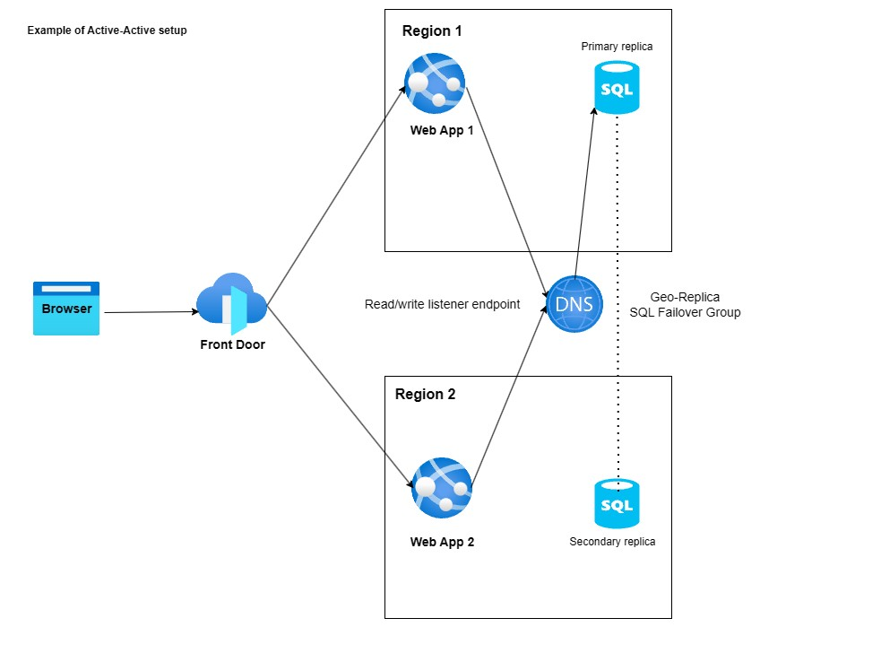

# Simple Web App for Azure Test Scenarios

This Web app interacts with an SQL database and is designed for various Azure test scenarios.

## Features

- **Region Awareness:** Displays the Azure region where the web app is running.
- **Auto Insert:** The "Auto Insert" button adds a record to the database every 3 seconds, enabling continuous testing and downtime/failover calculation.

> **Note:** Set the environment variable `Region` in each web app instance.
>
> **Note:** To run this app on IIS on Windows server publish the app to folder, place in C:\inetpub\wwwroot and install ASP.NET Core Runtime 9.0.5 hosting bundle https://dotnet.microsoft.com/en-us/download/dotnet/9.0

## Create SQL database and a table below

    CREATE TABLE TestData (
        Id INT PRIMARY KEY IDENTITY,
        Message NVARCHAR(MAX),
        InsertedAt DATETIME
    );

## Screenshots

## Tested Architectures

- **Multi-region App Service approaches for disaster recovery:**
  - Active/Active
  - Active/Passive

## Topology

In this topology, the web app is deployed in two regions and uses Azure Front Door for traffic routing. Azure SQL Database is configured in both regions with geo-replication enabled, ensuring data is synchronized and allowing failover to the secondary region in case of a disaster.

## DR Considerations

A web application often depends on other services such as Azure SQL Database, Azure Storage accounts, or others. When designing a disaster recovery (DR) strategy, consider each dependent Azure service in your DR planning.

## References

- [Multi-region App Service Architecture Guide (Microsoft Docs)](https://learn.microsoft.com/en-us/azure/architecture/web-apps/guides/multi-region-app-service/multi-region-app-service?tabs=paired-regions)
